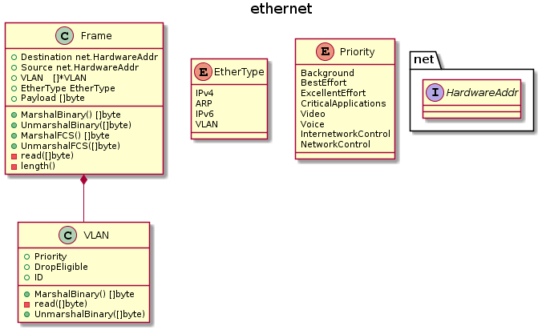

ethernet [](https://travis-ci.org/caser789/ethernet)
[](https://godoc.org/github.com/caser789/ethernet)
[](https://goreportcard.com/report/github.com/caser789/ethernet)
[](https://coveralls.io/r/caser789/ethernet?branch=master)
=====



```
@startuml

title ethernet

class Frame {
    +Destination net.HardwareAddr
    +Source net.HardwareAddr
    +VLAN   []*VLAN
    +EtherType EtherType
    +Payload []byte
    +MarshalBinary() []byte
    +UnmarshalBinary([]byte)
    +MarshalFCS() []byte
    +UnmarshalFCS([]byte)
    -read([]byte)
    -length()
}

enum EtherType {
    IPv4
    ARP
    IPv6
    VLAN
}

enum Priority {
	Background
	BestEffort
	ExcellentEffort
    CriticalApplications
	Video
	Voice
	InternetworkControl
	NetworkControl
}

interface net.HardwareAddr {}

class VLAN {
    +Priority
    +DropEligible
    +ID
    +MarshalBinary() []byte
    -read([]byte)
    +UnmarshalBinary([]byte)
}

Frame *-- VLAN

@enduml
```
